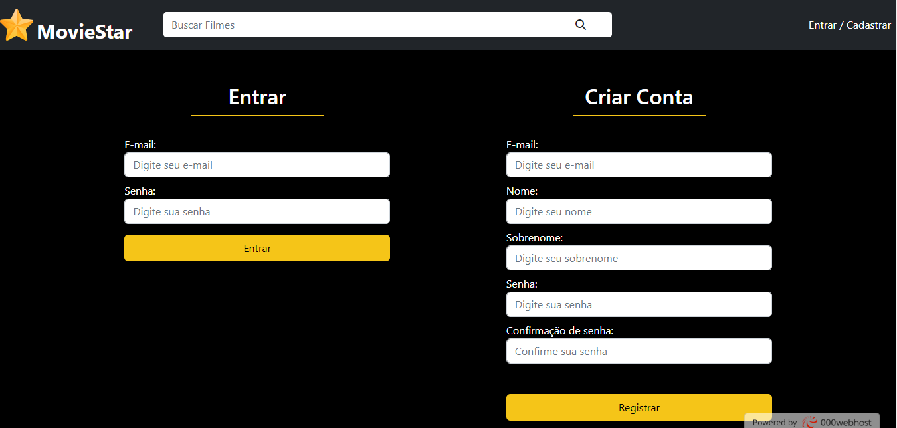
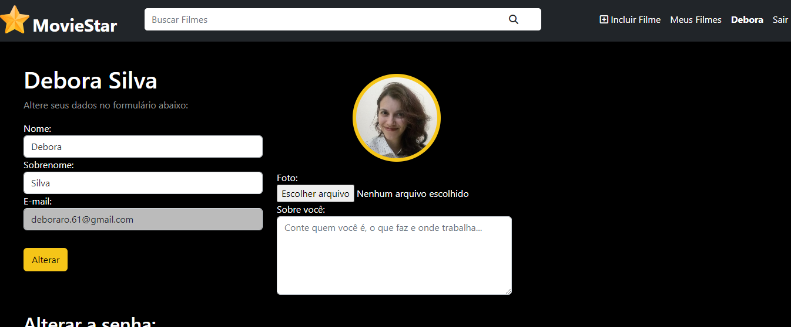
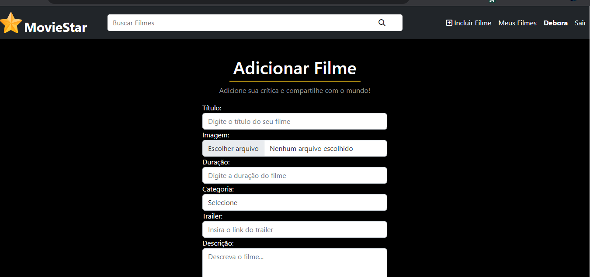
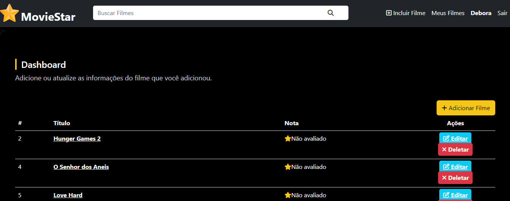
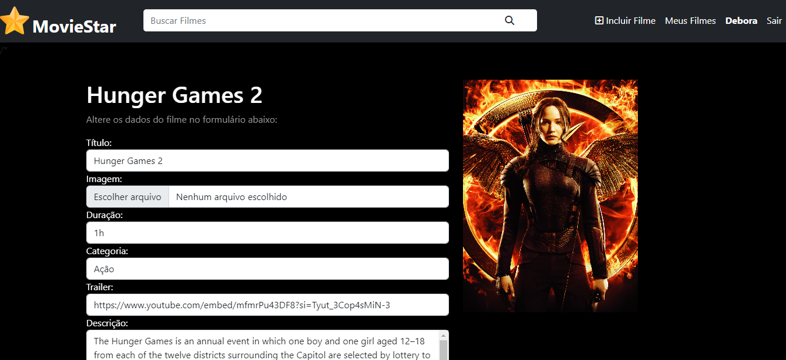

Criando as relações das entidades, usando o workbench.

# Concluindo o projeto Moviestar.
Este projeto foi feito em orientação objeto com PHP seguindo o pattern DAO. Aonde temos as classes definidas no arquivo model e suas respectivas interfaces.
Nos arquivos com o nome DAO foram construidas as querys para consumir os parâmetros da View e devolver as informações após seus processamentos junto ao banco.

Temos inicialmente uma tela de login que permite cadastrar ou apenas logar mesmo. A chave de identificação desta tela é o email.
Após realizado o login, você tem a area do seu perfil que é possível editar os dados inseridos no cadastro, a tela de controle que permite ver todos os filmes que você subiu e nela pode editar ou deletar.

Um das regras de negocio é que você não pode comentar no filme que fez upload;
Só pode comentar uma vez em cada filme;
Na parte de comentários é possivel clicar sobre o o nome do usuário, pois existe um link que redireciona para uma nova página mostrando todos os filme que ele realizou o upload.

